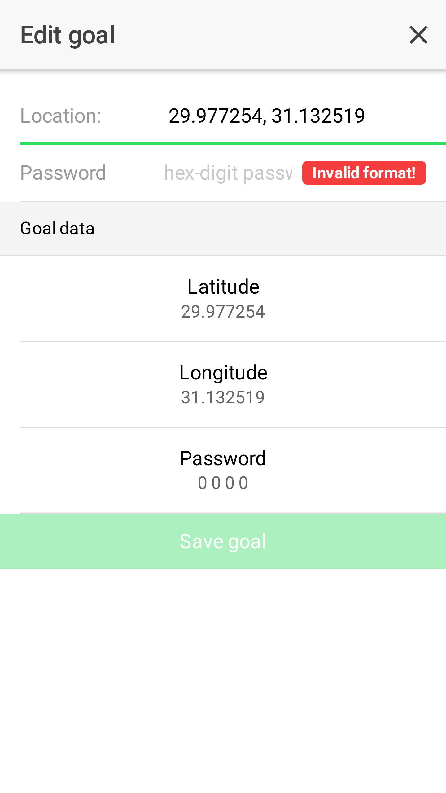

## geoc_app *[WIP]*

This app supports the [geoc puzzle](https://github.com/rwa96/geoc). It can be used, to upload waypoint information via WiFi.

### How it works

1.	Manage your puzzles

2.	Create and edit them

<ul style="list-style-type: none; width: 100%; height: 550px;">
	<li style="display: inline; float: left;">
		
	</li>
	<li style="display: inline; float: left; margin-left: 30px; clear: end;">
		
	</li>
</ul>

### Todos

*	The actual upload functionallity isn't implemented yet
*	Standalone App design
*	iPhone compatibillity
